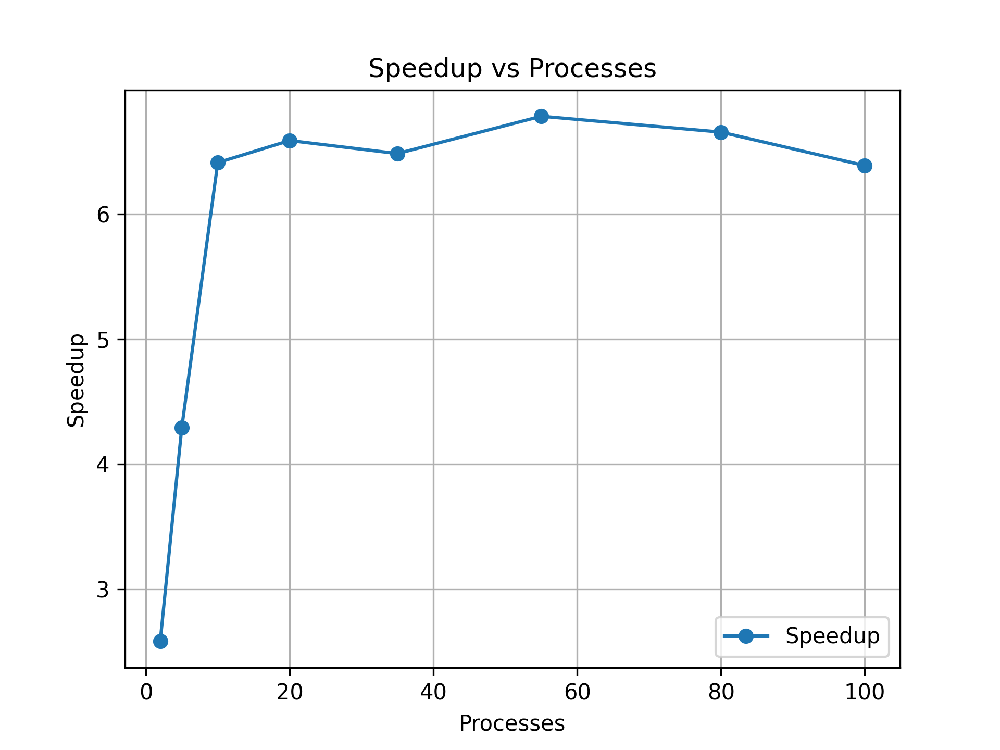
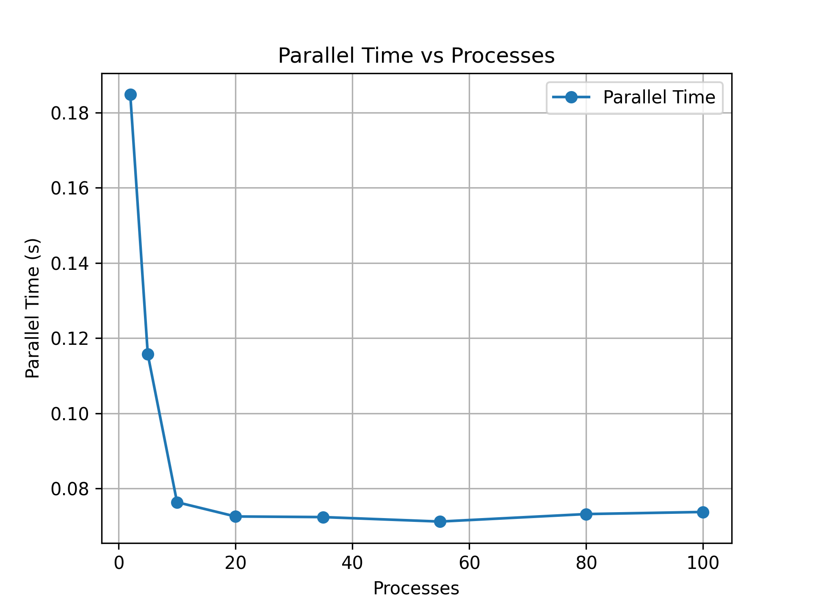
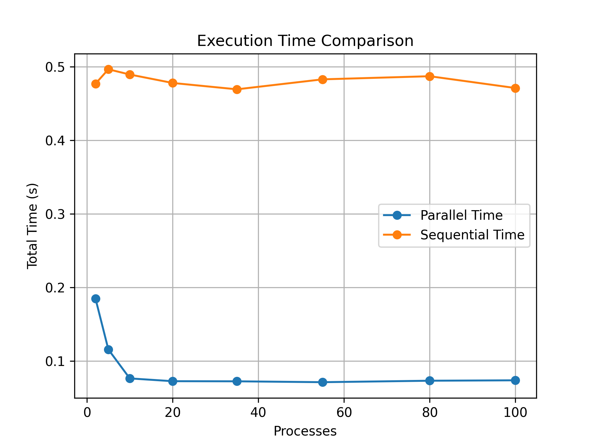

University of Antioquia - Operating Systems Course  
Practice #3 - Matrix Multiplication Using Processes  

Team Members:  
- Juan Pablo Gómez López - 1037665653
- Danilo Tovar - 1193578670

# Mecanismo IPC
Mecanismo IPC: Shared Memory
Razón: Ninguna en particular. La escogimos al azar.

# Resultados
Los resultados se pueden ver en el notebook [informe.ipynb](notebooks/informe.ipynb), en la carpeta notebooks. Sin embargo, se resume el proceso y se expone los resultados a continuación.

## Proceso
Se ejecutó el programa [matrix_mul](matrix_mul) para las matrices A_big.txt y B.txt, con los valores [2 5 10 20 35 55 80 100] en la cantidad de procesos. Esto generó un archivo csv con los tiempos totales de ejecución por cada proceso.

En cada iteración, el programa [matrix_mul](matrix_mul) calcula el resultado de la multiplcación, el tiempo de cálculo para un solo proceso (sequential) y para n procesos (parallel). 

Este proceso se automatizó en el script [run_experiment.sh](cpp_outputs/run_experiment.sh), el cual generó todos los resultados de la multiplicación con sus logs (las impresiones en consola) por cada iteración junto con el archivo csv que es una tabla comparativa con los tiempos. Todo esto se encuentra en la carpeta cpp_outputs.

A continuación se muestran las figuras que exponen visualmente los resultados.

## Speedup vs Processes

En este gráfico se observa como el speedup mejora abruptamente añadiendo unos pocos procesos. Sin embargo,  luego de 10 procesos, el speedup se mantiene constante.

## Parallel Time vs Processes

Se observa una caída abrupta del tiempo de ejecución al aumentar hasta 10 procesos. Posterior a esta cantidad, el tiempo permanece constante.

## Execution Time Comparison

Se compara la ejecución sequiencial con la Paralela. Se observa que la paralela es mejor (menor tiempo de ejecución) en todos los casos.

